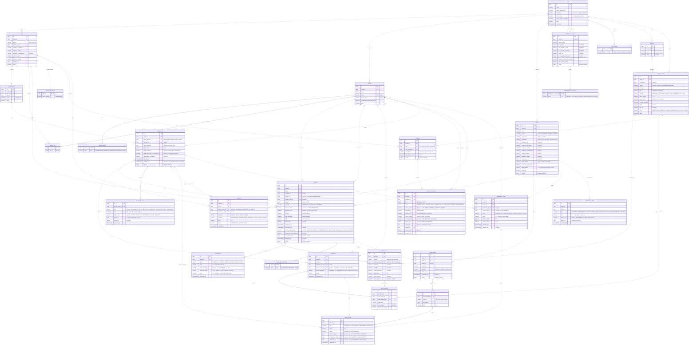

# Diagrama Entidade Relacionamento

```mermaid
erDiagram

%% ==================================================================
%% ERGANE APP — DER / Modelo Lógico Relacional (v2 · MVP)
%% Derivado do diagrama de classes v3 · SGBD alvo: PostgreSQL
%% ------------------------------------------------------------------
%% Convenções
%%  - Tabelas e colunas em snake_case; chave estrangeira = <tabela>_id
%%  - Linha contínua (--)  : composição — a filha não existe sem a mãe
%%                           (ON DELETE CASCADE)
%%  - Linha tracejada (..) : referência entre agregados (ON DELETE RESTRICT)
%%  - Cardinalidade (pé de galinha): || um · |o zero ou um ·
%%                                   o{ zero ou muitos · |{ um ou muitos
%%  - "opcional" no comentário = coluna aceita NULL; as demais são NOT NULL
%%  - conta_id (tenant) é FK para conta em todas as tabelas raiz; as linhas
%%    até conta foram desenhadas só para loja, usuario, cliente, categoria,
%%    item_vendavel e configuracao_negocio (as outras 10 foram omitidas
%%    para legibilidade)
%%  - Colunas de auditoria (criado_em, atualizado_em) existem em todas as
%%    tabelas com id próprio e foram omitidas
%%  - Precisões: dinheiro = numeric(15,2) · quantidade = numeric(15,3) ·
%%    percentual = numeric(5,2) · enums = varchar com CHECK
%%  - Ids (uuid) podem ser gerados no aparelho: reenviar a mesma venda ou o
%%    mesmo recebimento não duplica (idempotência pela PK)
%%  - Status de fiado e situação de estoque são calculados: não há coluna
%% ==================================================================

%% ========================= CADASTROS =========================
    conta {
        uuid id PK
        varchar nome
        varchar nome_responsavel
        varchar whatsapp "opcional · só dígitos, com DDD"
        varchar fuso_horario "ex.: America/Sao_Paulo"
        boolean boas_vindas_concluidas
        boolean ativa
        timestamptz criada_em
    }
    conta_ramo {
        uuid conta_id PK, FK
        varchar ramo PK "o que o negócio vende (boas-vindas)"
    }
    configuracao_negocio {
        uuid id PK
        uuid conta_id FK, UK
        boolean vender_fiado
        numeric taxa_debito "0 a 99,99"
        numeric taxa_credito_a_vista "0 a 99,99"
        numeric taxa_credito_parcelado "0 a 99,99"
        varchar chave_pix "opcional"
        integer prazo_padrao_fiado_dias "1 a 365"
        boolean bloquear_venda_sem_estoque
        numeric troco_inicial_padrao ">= 0"
        bigint versao "bloqueio otimista"
    }
    configuracao_forma_ativa {
        uuid configuracao_negocio_id PK, FK
        varchar forma PK "DINHEIRO, PIX, CARTAO_DEBITO, CARTAO_CREDITO, OUTRO"
    }
    loja {
        uuid id PK
        uuid conta_id FK
        varchar nome "único por conta"
        char endereco_cep
        varchar endereco_logradouro
        varchar endereco_numero
        varchar endereco_complemento "opcional"
        varchar endereco_bairro
        varchar endereco_cidade
        char endereco_uf
        boolean ativa
    }
    ponto_venda {
        uuid id PK
        uuid conta_id FK
        uuid loja_id FK
        varchar nome "único por loja"
        boolean ativo
    }
    usuario {
        uuid id PK
        uuid conta_id FK
        varchar nome
        varchar email UK "login"
        varchar senha_hash "BCrypt"
        numeric percentual_maximo_desconto
        boolean ativo
    }
    usuario_papel {
        uuid usuario_id PK, FK
        varchar papel PK "PROPRIETARIO, GERENTE, VENDEDOR, OPERADOR_CAIXA"
    }
    usuario_loja {
        uuid usuario_id PK, FK
        uuid loja_id PK, FK
    }
    cliente {
        uuid id PK
        uuid conta_id FK
        varchar nome
        varchar telefone "opcional · WhatsApp, só dígitos, com DDD"
        varchar observacao "opcional · apelido"
        varchar documento "opcional · CPF ou CNPJ · único por conta"
        char endereco_cep "opcional"
        varchar endereco_logradouro "opcional"
        varchar endereco_numero "opcional"
        varchar endereco_complemento "opcional"
        varchar endereco_bairro "opcional"
        varchar endereco_cidade "opcional"
        char endereco_uf "opcional"
        numeric limite_credito "opcional · nulo = sem limite"
        boolean bloqueado_para_fiado
        numeric saldo_credito ">= 0 · saldo de lancamento_credito"
        boolean arquivado
        bigint versao "bloqueio otimista"
    }

%% ========================= CATALOGO =========================
    categoria {
        uuid id PK
        uuid conta_id FK
        varchar nome "único por conta"
        varchar emoji "opcional"
    }
    item_vendavel {
        uuid id PK
        uuid conta_id FK
        uuid categoria_id FK "opcional"
        varchar codigo "opcional · único por conta quando preenchido"
        varchar descricao
        varchar tipo "PRODUTO, SERVICO"
        varchar unidade "UNIDADE, QUILOGRAMA, GRAMA, LITRO, PACOTE, CAIXA, DUZIA"
        numeric preco_venda ">= 0"
        numeric preco_custo "opcional · nulo = não sei"
        boolean controla_estoque
        varchar emoji "opcional"
        varchar foto_url "opcional"
        varchar cor "VERDE, AZUL, AMARELO, LARANJA, VERMELHO, ROSA, ROXO, CINZA"
        boolean ativo
    }

%% ========================= VENDAS =========================
    venda {
        uuid id PK
        uuid conta_id FK
        uuid loja_id FK
        uuid vendedor_id FK "usuario"
        uuid cliente_id FK "opcional · obrigatório quando há fiado"
        uuid sessao_caixa_id FK "opcional"
        bigint numero "único por loja"
        varchar situacao "CONFIRMADA, CANCELADA, DESFEITA"
        varchar desconto_tipo "opcional · VALOR, PERCENTUAL"
        numeric desconto_valor "opcional · em R$ ou de 0 a 100"
        numeric subtotal "desnormalizado"
        numeric valor_desconto "desnormalizado"
        numeric total "desnormalizado"
        varchar observacao "opcional"
        timestamptz registrada_em
        timestamptz cancelada_em "opcional"
        varchar motivo_cancelamento "opcional · REGISTRO_ERRADO, CLIENTE_DESISTIU, DEVOLUCAO, PAGAMENTO_NAO_CAIU, OUTRO"
        varchar observacao_cancelamento "opcional"
        uuid cancelado_por_id FK "opcional · usuario"
        timestamptz desfeita_em "opcional"
        bigint versao "bloqueio otimista"
    }
    venda_alerta_ignorado {
        uuid venda_id PK, FK
        varchar alerta PK "BLOQUEADO, ATRASADO, LIMITE"
    }
    numeracao_venda {
        uuid loja_id PK, FK
        bigint ultimo_numero "tabela técnica"
    }
    item_venda {
        uuid id PK
        uuid venda_id FK
        integer posicao "ordem do item na venda"
        uuid item_vendavel_id FK "opcional · nulo = valor avulso"
        varchar descricao "snapshot"
        varchar unidade "snapshot"
        boolean controla_estoque "snapshot"
        numeric quantidade "> 0"
        numeric preco_unitario "snapshot"
        numeric custo_unitario "opcional · snapshot"
    }
    recebimento {
        uuid id PK
        uuid venda_id FK
        varchar forma "DINHEIRO, PIX, CARTAO_DEBITO, CARTAO_CREDITO, OUTRO"
        numeric valor "> 0 · quanto abate do total"
        numeric valor_entregue "opcional · só em DINHEIRO · >= valor"
        integer parcelas_cartao "1 a 12 · mais de 1 só em CARTAO_CREDITO"
        numeric taxa ">= 0 · snapshot · custo, não muda o valor"
        timestamptz recebido_em
    }
    devolucao {
        uuid id PK
        uuid conta_id FK
        uuid venda_id FK
        uuid registrada_por_id FK "usuario"
        uuid sessao_caixa_id FK "opcional · obrigatória no reembolso em DINHEIRO"
        varchar forma_reembolso "DINHEIRO, PIX, ABATIMENTO_FIADO, CREDITO_CLIENTE"
        varchar motivo
        timestamptz registrada_em
    }
    item_devolvido {
        uuid id PK
        uuid devolucao_id FK
        uuid item_venda_id FK
        uuid item_vendavel_id FK
        numeric quantidade
        numeric valor_unitario "snapshot"
        boolean retorna_ao_estoque
    }

%% ========================= ESTOQUE =========================
    estoque {
        uuid id PK
        uuid conta_id FK
        uuid loja_id FK "único junto com item_vendavel_id"
        uuid item_vendavel_id FK
        numeric quantidade "pode ficar negativa (regra 5.5)"
        numeric quantidade_minima ">= 0"
        bigint versao "bloqueio otimista"
    }
    movimento_estoque {
        uuid id PK
        uuid conta_id FK
        uuid estoque_id FK
        varchar tipo "ENTRADA, SAIDA"
        varchar motivo "COMPRA, VENDA, CANCELAMENTO_VENDA, DEVOLUCAO, AJUSTE, PERDA, TRANSFERENCIA"
        varchar motivo_perda "opcional · só em PERDA · VENCIDO, QUEBRADO, OUTRO"
        numeric quantidade "sempre positiva"
        numeric saldo_apos "quantidade depois do movimento"
        numeric custo_unitario "opcional · só em ENTRADA"
        numeric custo_anterior "opcional · só em ENTRADA · para desfazer"
        varchar origem_tipo "opcional · VENDA, DEVOLUCAO"
        uuid origem_id "opcional · polimórfica, sem FK"
        uuid usuario_id FK
        varchar observacao "opcional"
        timestamptz ocorrido_em
    }

%% ========================= CAIXA =========================
    sessao_caixa {
        uuid id PK
        uuid conta_id FK
        uuid ponto_venda_id FK "uma sessão aberta por ponto de venda"
        uuid operador_id FK "usuario"
        date data_referencia "dia civil no fuso da conta"
        numeric saldo_inicial ">= 0"
        numeric saldo_contado "opcional · informado no fechamento"
        numeric saldo_esperado_no_fechamento "opcional · congelado ao fechar"
        varchar observacao_fechamento "opcional"
        timestamptz aberta_em
        timestamptz fechada_em "opcional · nula enquanto aberta ou reaberta"
        bigint versao "bloqueio otimista"
    }
    movimento_caixa {
        uuid id PK
        uuid sessao_caixa_id FK
        varchar tipo "VENDA, RECEBIMENTO_FIADO, DESPESA, SUPRIMENTO, SANGRIA, ESTORNO, REEMBOLSO"
        numeric valor "> 0 · o tipo diz se entra ou sai"
        varchar origem_tipo "opcional · VENDA, DEVOLUCAO, RECEBIMENTO_FIADO, DESPESA"
        uuid origem_id "opcional · polimórfica, sem FK"
        varchar descricao "opcional"
        timestamptz ocorrido_em
    }
    despesa {
        uuid id PK
        uuid conta_id FK
        uuid loja_id FK
        uuid sessao_caixa_id FK "opcional · obrigatória em DINHEIRO_DA_GAVETA"
        uuid registrada_por_id FK "usuario"
        varchar descricao "opcional · vazia = nome da categoria"
        varchar categoria "MERCADORIA, TRANSPORTE, ALIMENTACAO, PONTO, TAXAS, OUTROS"
        numeric valor "> 0"
        varchar forma "DINHEIRO_DA_GAVETA, OUTRA"
        timestamptz ocorrida_em
    }

%% ========================= FINANCEIRO =========================
    conta_receber {
        uuid id PK
        uuid conta_id FK
        uuid cliente_id FK
        uuid venda_id FK, UK
        numeric valor_total "> 0"
        varchar situacao "ABERTA, QUITADA, CANCELADA"
        timestamptz criada_em
        timestamptz cancelada_em "opcional"
        bigint versao "bloqueio otimista"
    }
    parcela {
        uuid id PK
        uuid conta_receber_id FK
        integer numero "único por conta a receber"
        date vencimento
        numeric valor "> 0"
    }
    baixa_parcela {
        uuid id PK
        uuid parcela_id FK
        varchar tipo "PAGAMENTO, USO_CREDITO, ABATIMENTO_DEVOLUCAO"
        numeric valor "> 0"
        varchar forma "opcional · só em PAGAMENTO"
        uuid sessao_caixa_id FK "opcional · só em PAGAMENTO em DINHEIRO"
        uuid recebimento_fiado_id FK "opcional · em PAGAMENTO e USO_CREDITO"
        uuid devolucao_id FK "opcional · só em ABATIMENTO_DEVOLUCAO"
        timestamptz registrada_em
    }
    recebimento_fiado {
        uuid id PK
        uuid conta_id FK
        uuid cliente_id FK
        uuid registrado_por_id FK "usuario"
        uuid sessao_caixa_id FK "opcional · só em DINHEIRO"
        varchar forma "DINHEIRO, PIX, CARTAO_DEBITO, CARTAO_CREDITO, OUTRO"
        numeric valor "> 0 · dinheiro novo recebido"
        numeric credito_usado ">= 0"
        numeric credito_gerado ">= 0"
        timestamptz recebido_em
        timestamptz desfeito_em "opcional"
    }
    lancamento_credito {
        uuid id PK
        uuid conta_id FK
        uuid cliente_id FK
        varchar tipo "EXCEDENTE_RECEBIMENTO, CANCELAMENTO_VENDA, DEVOLUCAO, USO_EM_RECEBIMENTO, ESTORNO"
        numeric valor "> 0 · o tipo diz se entra ou sai"
        varchar origem_tipo "VENDA, RECEBIMENTO_FIADO, DEVOLUCAO"
        uuid origem_id "polimórfica, sem FK"
        timestamptz ocorrido_em
    }

%% ===== Relacionamentos: Cadastros =====
    conta ||..o{ loja : "possui"
    conta ||..o{ usuario : "possui"
    conta ||..o{ cliente : "possui"
    conta ||..|| configuracao_negocio : "é configurada por"
    conta ||--o{ conta_ramo : "vende"
    configuracao_negocio ||--|{ configuracao_forma_ativa : "ativa"
    loja ||..o{ ponto_venda : "possui"
    usuario ||--o{ usuario_papel : "tem"
    usuario ||--o{ usuario_loja : "é autorizado em"
    loja ||..o{ usuario_loja : "autoriza"

%% ===== Relacionamentos: Catálogo =====
    conta ||..o{ categoria : "possui"
    conta ||..o{ item_vendavel : "possui"
    categoria |o..o{ item_vendavel : "classifica"

%% ===== Relacionamentos: Vendas =====
    loja ||..o{ venda : "registra"
    loja ||..o| numeracao_venda : "numera vendas"
    usuario ||..o{ venda : "vende"
    usuario |o..o{ venda : "cancela"
    cliente |o..o{ venda : "compra"
    sessao_caixa |o..o{ venda : "registra"
    venda ||--|{ item_venda : "contém"
    venda ||--o{ recebimento : "recebe"
    venda ||--o{ venda_alerta_ignorado : "confirmou apesar de"
    item_vendavel |o..o{ item_venda : "é vendido em"
    venda ||..o{ devolucao : "sofre"
    usuario ||..o{ devolucao : "registra"
    sessao_caixa |o..o{ devolucao : "reembolsa"
    devolucao ||--|{ item_devolvido : "contém"
    item_venda ||..o{ item_devolvido : "é devolvido em"
    item_vendavel ||..o{ item_devolvido : "retorna como"

%% ===== Relacionamentos: Estoque =====
    loja ||..o{ estoque : "mantém"
    item_vendavel ||..o{ estoque : "tem saldo em"
    estoque ||..o{ movimento_estoque : "registra"
    usuario ||..o{ movimento_estoque : "é responsável por"

%% ===== Relacionamentos: Caixa =====
    ponto_venda ||..o{ sessao_caixa : "abre"
    usuario ||..o{ sessao_caixa : "opera"
    sessao_caixa ||--o{ movimento_caixa : "contém"
    loja ||..o{ despesa : "tem"
    usuario ||..o{ despesa : "registra"
    sessao_caixa |o..o{ despesa : "paga com a gaveta"

%% ===== Relacionamentos: Financeiro =====
    cliente ||..o{ conta_receber : "deve"
    venda ||..o| conta_receber : "gera fiado"
    conta_receber ||--|{ parcela : "divide-se em"
    parcela ||--o{ baixa_parcela : "recebe"
    sessao_caixa |o..o{ baixa_parcela : "recebe em dinheiro"
    devolucao |o..o{ baixa_parcela : "abate"
    recebimento_fiado |o..o{ baixa_parcela : "abate"
    cliente ||..o{ recebimento_fiado : "paga"
    usuario ||..o{ recebimento_fiado : "registra"
    sessao_caixa |o..o{ recebimento_fiado : "recebe em dinheiro"
    cliente ||..o{ lancamento_credito : "tem crédito em"
```
